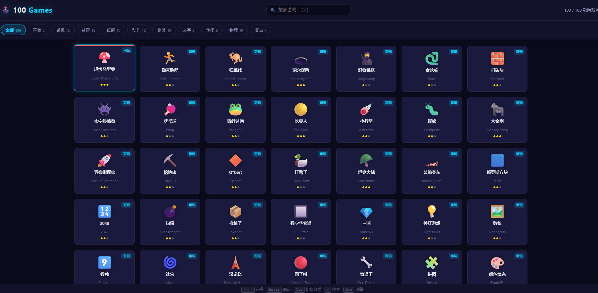
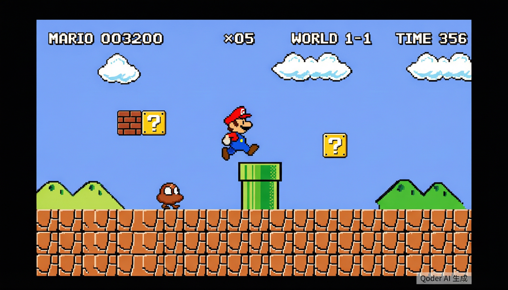
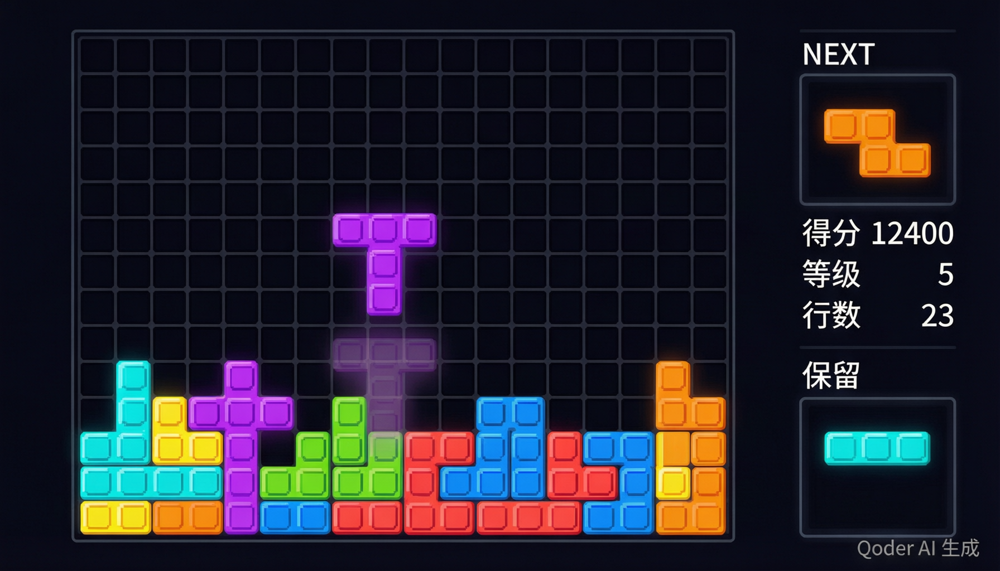
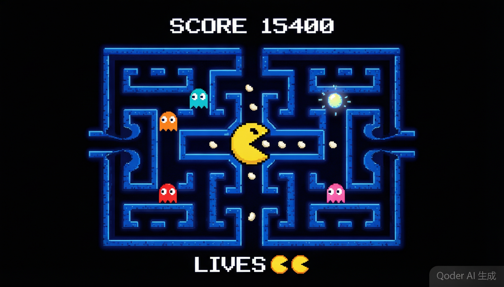
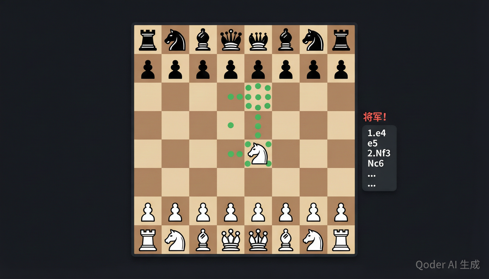
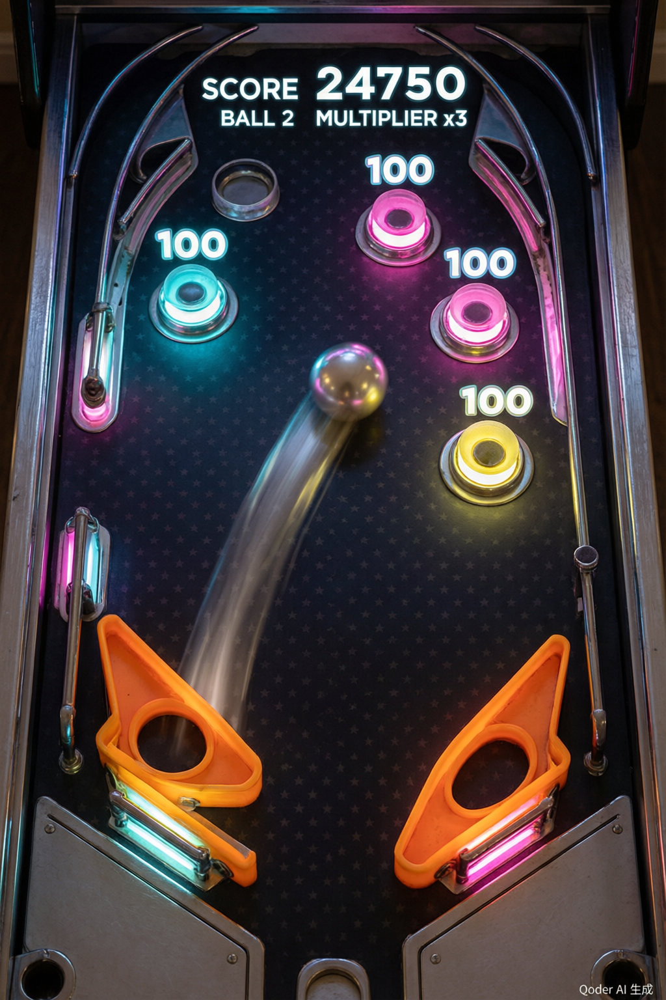

# 🕹️ 100 Games Collection

**纯前端 100 款经典小游戏合集** — 无需安装、无需服务器、打开即玩。

[English](#english-version)

---

## 游戏截图

| 游戏菜单 | 超级马里奥 |
|:---:|:---:|
|  |  |

| 俄罗斯方块 | 吃豆人 |
|:---:|:---:|
|  |  |

| 国际象棋 | 弹球台 |
|:---:|:---:|
|  |  |

---

## 快速开始

```bash
# 方式一：直接打开
# 双击 index.html 即可在浏览器中运行

# 方式二：本地服务器（推荐）
npx serve .
# 或
python -m http.server 8080
```

打开浏览器访问 `http://localhost:8080`（或直接打开 `index.html`），即可看到 100 款游戏的菜单界面。

## 操作方式

| 按键 | 功能 |
|------|------|
| `↑ ↓ ← →` | 在游戏菜单中移动焦点 |
| `Enter` | 确认 / 开始游戏 |
| `Tab` | 切换游戏分类 |
| `/` | 聚焦搜索框 |
| `Esc` | 返回菜单 / 退出当前游戏 |

## 游戏分类（100 款）

| 分类 | 数量 | 代表游戏 |
|------|:----:|----------|
| 🍄 平台 | 5 | 超级马里奥、像素跑酷、弹跳球、洞穴探险、忍者跳跃 |
| 👾 街机 | 15 | 吃豆人、太空侵略者、打砖块、大金刚、坦克大战、小行星 |
| 🧩 益智 | 15 | 俄罗斯方块、2048、扫雷、推箱子、数独、三消 |
| 🃏 纸牌 | 10 | 纸牌接龙、空当接龙、蜘蛛纸牌、21点、视频扑克 |
| ⚡ 动作 | 12 | 像素鸟、水果忍者、几何冲刺、节奏点击、躲避弹幕 |
| ♟️ 棋类 | 10 | 国际象棋、围棋、五子棋、黑白棋、战舰 |
| 📝 文字 | 8 | 猜单词(Wordle)、填字游戏、知识问答、字母网格 |
| 🎰 休闲 | 8 | 老虎机、轮盘、快艇骰子、骰宝、高低猜 |
| 🎱 物理 | 10 | 弹弓小鸟、弹球台、台球、迷你高尔夫、保龄球 |
| 🕹️ 复古 | 7 | 炸弹人、生命游戏、俄罗斯方块对战、月球着陆 |

## 技术架构

```
├── index.html              # 启动器主界面（游戏菜单）
├── css/
│   ├── theme.css           # 全局暗色主题变量
│   └── launcher.css        # 菜单 UI 样式
├── js/
│   ├── registry.js         # 100 款游戏元数据注册表
│   └── launcher.js         # 菜单逻辑 / 键盘导航 / iframe 路由
├── games/                  # 每款游戏一个独立 HTML 文件
│   ├── platformer/         #   平台类 (5)
│   ├── arcade/             #   街机类 (15)
│   ├── puzzle/             #   益智类 (15)
│   ├── card/               #   纸牌类 (10)
│   ├── action/             #   动作类 (12)
│   ├── board/              #   棋类 (10)
│   ├── word/               #   文字类 (8)
│   ├── casino/             #   休闲类 (8)
│   ├── physics/            #   物理类 (10)
│   └── retro/              #   复古类 (7)
└── assets/
    └── screenshots/        # 游戏截图
```

**设计原则：**

- 每款游戏是**完全独立的单 HTML 文件**，可单独打开运行
- 通过 **iframe 隔离**加载，游戏崩溃不影响主界面
- **零依赖**：纯 HTML + CSS + JavaScript，无需任何框架或构建工具
- 所有素材**程序化生成**（Canvas 绘制像素画、Web Audio 合成音效），无外部资源
- 游戏内按 `Esc` 通过 `postMessage` 协议返回菜单

## 浏览器兼容

支持所有现代浏览器（Chrome / Edge / Firefox / Safari），需要启用 JavaScript 和 Canvas 2D。

## License

MIT — 仅供学习交流使用。游戏中涉及的经典玩法致敬原作，不用于商业用途。

---

<a id="english-version"></a>

## English Version

# 🕹️ 100 Games Collection

**100 classic mini-games in pure HTML5** — no install, no server, just open and play.

[中文](#-100-games-collection)

---

### Screenshots

| Game Menu | Super Mario |
|:---:|:---:|
|  |  |

| Tetris | Pac-Man |
|:---:|:---:|
|  |  |

| Chess | Pinball |
|:---:|:---:|
|  |  |

---

### Quick Start

```bash
# Option 1: Just open index.html in your browser

# Option 2: Local server (recommended)
npx serve .
# or
python -m http.server 8080
```

### Controls

| Key | Action |
|-----|--------|
| `↑ ↓ ← →` | Navigate game grid |
| `Enter` | Confirm / Start game |
| `Tab` | Switch category |
| `/` | Focus search |
| `Esc` | Back to menu / Exit game |

### Game Categories (100 total)

| Category | Count | Highlights |
|----------|:-----:|------------|
| 🍄 Platformer | 5 | Super Mario, Pixel Runner, Doodle Jump, Spelunky Lite |
| 👾 Arcade | 15 | Pac-Man, Space Invaders, Breakout, Donkey Kong, Tank Battle |
| 🧩 Puzzle | 15 | Tetris, 2048, Minesweeper, Sokoban, Sudoku, Match-3 |
| 🃏 Card | 10 | Klondike, FreeCell, Spider, Blackjack, Video Poker |
| ⚡ Action | 12 | Flappy Bird, Fruit Ninja, Geometry Dash, Rhythm Tap |
| ♟️ Board | 10 | Chess, Go 9×9, Gomoku, Reversi, Battleship |
| 📝 Word | 8 | Wordle, Crossword, Trivia, Boggle |
| 🎰 Casino | 8 | Slot Machine, Roulette, Yahtzee, Craps |
| 🎱 Physics | 10 | Angry Birds Lite, Pinball, Billiards, Mini Golf |
| 🕹️ Retro | 7 | Bomberman, Game of Life, Tetris vs AI, Lunar Lander |

### Architecture

Each game is a **self-contained single HTML file** loaded via **iframe isolation**. Zero dependencies — pure vanilla HTML/CSS/JS with programmatic pixel art and Web Audio synthesized sound effects. No external assets, no build tools, no frameworks.

### Browser Support

All modern browsers (Chrome / Edge / Firefox / Safari) with JavaScript and Canvas 2D enabled.

### License

MIT — for learning and personal use only. Classic gameplay mechanics are tributes to original games, not for commercial use.
